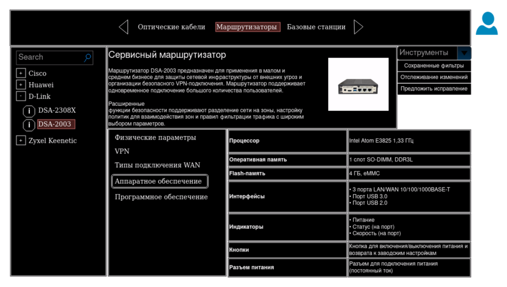

# Учебный проект курса OTUS. Kotlin Professional 2023-10

## Описание

#### <u>Библиотека спецификаций телеком оборудования</u>

Приложение, предоставляющее возможность поиска, добавления и корректировки информации о моделях, компонентах и
вариантах поставки телекоммуникационного оборудования.

#### <u>Проблематика</u>

Различные вендоры и поставщики оборудования имеют собственные каталоги, информация в которых не систематизирована.
Зачастую спецификации оборудования представляют из себя простые таблицы, представленные в виде html разметки или
pdf/xlsx файлов. Унифицированный поиск и сравнение по специфическим характеристикам между различными вендорами затруднен
и не всегда возможен.

#### <u>Приложение "Библиотека спецификаций" обеспечивает</u>

* Хранение публичной информации об оборудовании в систематизированном виде
* Поиск подходящего оборудования по произвольному набору параметров
* Отправку запроса на дополнение/корректировку существующих спецификаций
* Обработку запроса на дополнение/корректировку с последующей публикацией изменений в библиотеке
* Механизм настройки уведомлений об изменениях в спецификациях по произвольному набору атрибутов

## Документация по проекту

### Маркетинг

1. [Стейкхолдеры](docs/marketing/01-stakeholders.md)
2. [Целевая аудитория](docs/marketing/02-target-audience.md)
3. [Конкурентный анализ](docs/marketing/03-concurrency.md)
4. [Анализ экономики](docs/marketing/04-economy.md)
5. [Пользовательские истории](docs/marketing/05-user-stories.md)

## Архитектура приложения

1. [Компонентная архитектура](docs/arch/01-component.md)
2. [Схема межмодульного взаимодействия](docs/arch/02-integration.md)

## Инфраструктура логирования и мониторинга

#### Реализована на стеке ELK

Настроены индексы

* `app-logs-*` - количество обращений к сервису
* `cpu-load-*` - утилизация cpu сервисом

#### Подготовка образа сервиса

* Задать env `PWD` - путь до каталога `deploy`
* Собрать docker образ, используя команды
  ```
    cd ${PWD}
    docker build -t otus-nginx:0.0.1 . 
  ```

#### Управление стендом

* Выполнить для запуска

  ```
      cd ${PWD}
      docker-compose up
  ```

* Выполнить для остановк

  ```
      cd ${PWD}
      docker-compose down
  ```

* При необходимости тонкой настройки docker-compose
  см. [документацию](https://docs.docker.com/engine/reference/commandline/compose_up/)

## UX/UI



